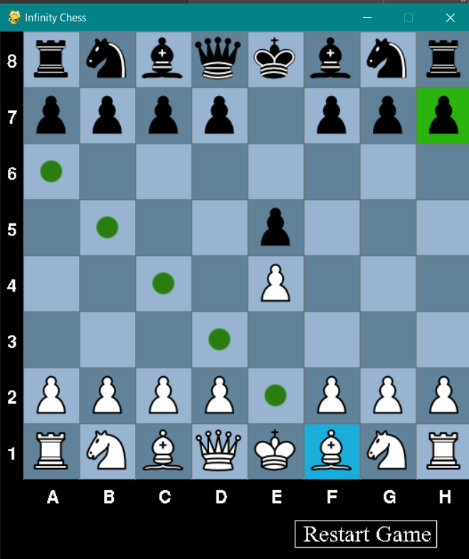
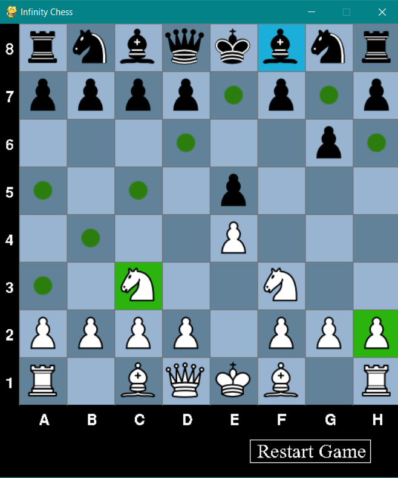
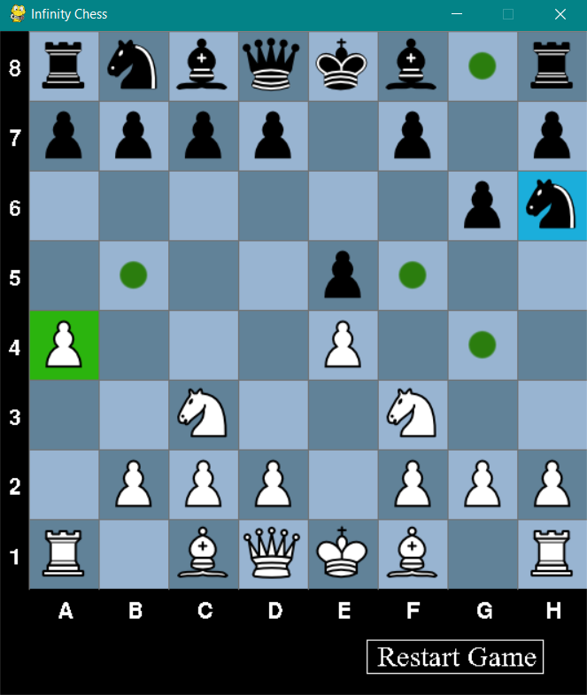
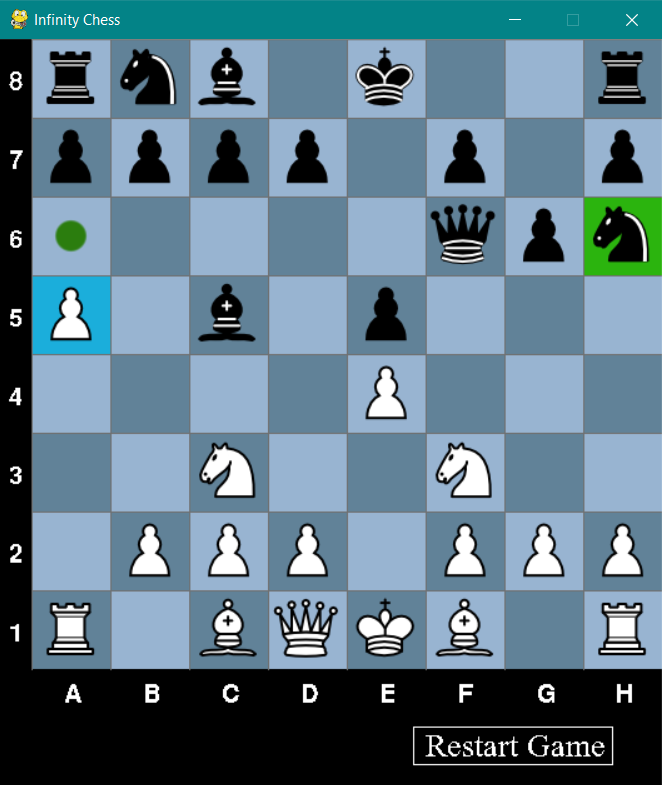
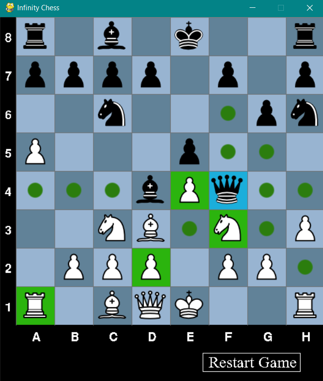
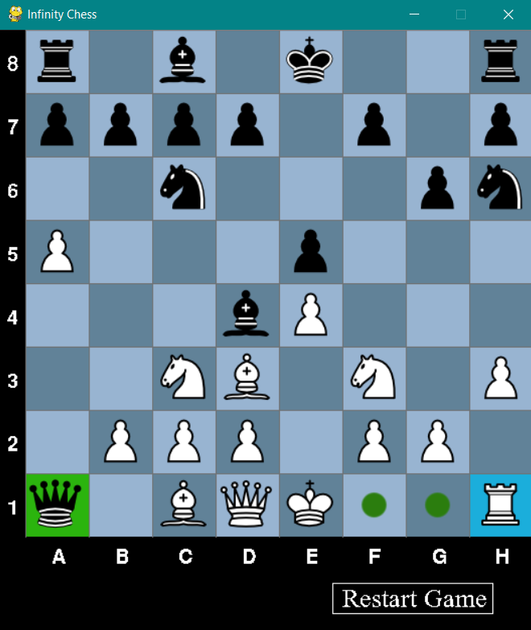
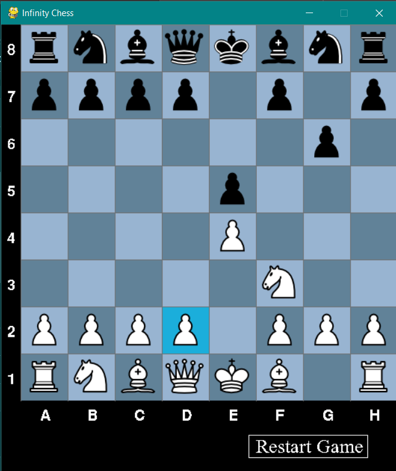
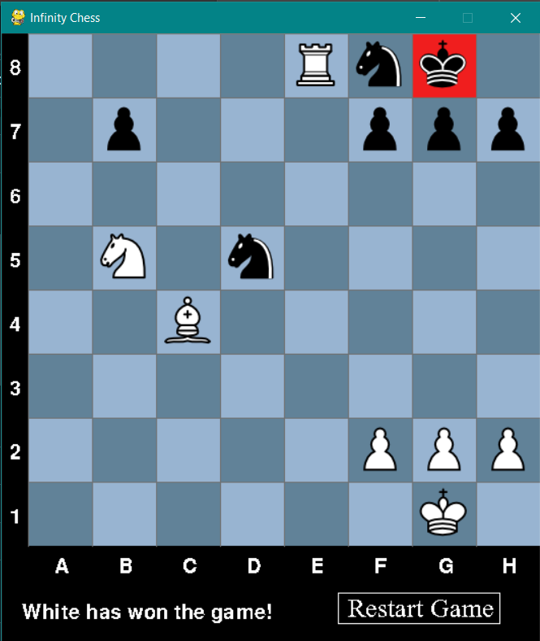

# About
Imagine Chess, but your pieces can go through walls and come out the other side. The Queen is all-powerful and can attack from almost anywhere. Bishops have a new advantage of attacking through the walls. Knights stuck on a wall are no longer inactive, but see just as many squares as if they were in the middle of the board.

:infinity: **Infinity Chess** :infinity:  
A new way to play chess without the constraints of the typical board game. More chaotic, filled with terror, and will have your hardcore chess friends running away from the board.

# Getting Started
The project is relatively simple in dependencies and only requires pygame. It is so simple that you may be able to use any version of python and pygame. If you want to completely match my setup, then once you have an environment with python 3.9.7, you can run  
```bash
pip install pygame==2.6.1
```
or
```bash
pip install -r requirements.txt
```
Next, run the main file and you're good
```bash
python main.py
```

# What Is Different From Regular Chess?
The gimick of this game is that the left and right side of the board "wrap around", where anything can move into the left wall and come out of the right wall, or vice versa.



In this example, the white Bishop is able to wrap around the walls in its path from A6 to H7.

Things get even more confusing as pieces move around. Here, the Bishop has a myriad of options from following either of the paths available to them. Either they move right, wrap around a wall, and have the option to take the Knight, or they move left, and can take the Pawn.  


What about the Knight? Normally, being on a wall is not a good position for a Knight. Now it can move around to the other side, even having the option to take the Pawn.  


The Pawns on the A and H lines also become more powerful. Here, what would normally be a lone Pawn is now attacking the knight on the other side of the board.


The Queen becomes infinitely more powerful. Here, she has the ability to wrap around while attacking pieces such as the rook, as well as moving to the left side of the board even though there is a Pawn and Bishop to her left.  


However, taking the Rook is not a great move. White's Rook is able to wrap around the right side to capture the Queen; this game has Rooks protect each other before anyone even moves.  


## Interesting Examples
Bishops can be quite powerful, and it isn't always obvious how threatning they are. For example, in this position, white cannot move their Pawn on D2
  
If the Pawn moved forward, black's Bishop on F8 would have a clear line of sight onto the King, meaning the D2 Pawn is stuck.

Rooks also have a new advantage. In the following position, normally black would be defended from the Rook, but now it is actually trapped.  
  
The Rook can wrap around the wall to attack the King, and the King has no way to escape.

# History
I cannot claim credit for the idea of this project. I was first exposed to the idea of a chess board which wraps around the left and right side in high school when some of my friends did a hackathon. I was busy that weekend and couldn't be in their team, but after the hackathon they showed me the project to help get it fully working. We love when hackathon projects extend past the duration of a competition. I was extremely interested in the idea, so I decided to make it myself in the language I knew best for games with visuals: python! I also had minimal knowledge of chess at the time, so I had to look up some of the finer points, and I'm likely still missing rules. I know for a fact that I didn't implement stalemates.
